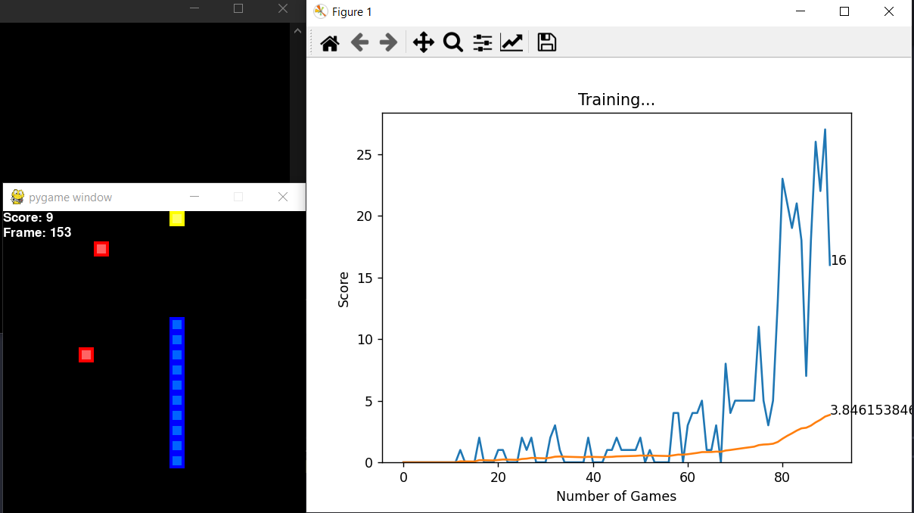

# Deep-Q Learning Snake

<div>
    
    
</div>

## Introduction

This project is to train an snake which is controlled by Deep-Q Learning. It also consist of 4 different strategies to use by combining **AStar algorithm** with **DeepQNet**:
- AStar only
- DeepQ only
- Both (AStar is prioritized)
- Both (random choice between 2 algorithms)

## Gallery

<p align="center">
    
</p>
<p align="center">
    Training process
</p>

## Model architecture


<p align="center">
    
</p>
<p align="center">
    DQN model architecture
</p>

## Usage

Firstly, to use the source, please change directory into `/src`:
```bash
cd src
```

### Libraries installation

To run the code, please install all the required libraries:

```bash
pip install -r requirements.txt
```

### Configuration

```bash
python utils/gen_conf.py --size 10 \
    --speed 60 \
    --memory 100000 \
    --batch_size 1000 \
    --learning_rate 0.001 \
    --gamma 0.9
```

### Train models

You can either use a pre-defined map from `data` with:

```bash
python utils/train.py --input_path "../data/input2.txt" \
    --output_path "../models" 
```

Or generate a new map randomly after each game:

```bash
python utils/train.py --output_path "../models" \
    --game_size 20 \
    --num_food 100 \
    --num_block 10
```

If you want to train from the checkpoint, add flag `--resume`. The model will load the lastest first, otherwise the `model_best.bin` will be loaded.

### Run inference

```bash
python utils/inference.py --from_test 1 \
    --to_test 3 \
    --data_folder "../data" \
    --output_folder "../output" \
    --model_path "../models"
```

## Test result

I have tested the [best model](models/model_best.bin) with 10 testsets in [data folder](data). The result is shown below:

```
========== Load model ==========
File name: ../models/model_best.bin
Epoch: 543
Score: 61
Total score: 8045
Inference: True
================================
TEST    AS      RL      BOTH
1       27      22      35
2       50      24      56
3       96      18      108
4       137     62      142
5       113     1       124
6       134     69      134
7       142     27      281
8       225     8       314
9       188     51      226
10      198     80      370
```

## Citation

```bibtex
@article{DBLP:journals/corr/MnihKSGAWR13,
  author    = {Volodymyr Mnih and
               Koray Kavukcuoglu and
               David Silver and
               Alex Graves and
               Ioannis Antonoglou and
               Daan Wierstra and
               Martin A. Riedmiller},
  title     = {Playing Atari with Deep Reinforcement Learning},
  journal   = {CoRR},
  volume    = {abs/1312.5602},
  year      = {2013},
  url       = {http://arxiv.org/abs/1312.5602},
  eprinttype = {arXiv},
  eprint    = {1312.5602},
  timestamp = {Mon, 13 Aug 2018 16:47:42 +0200},
  biburl    = {https://dblp.org/rec/journals/corr/MnihKSGAWR13.bib},
  bibsource = {dblp computer science bibliography, https://dblp.org}
}
```

## License
[MIT](LICENSE)
